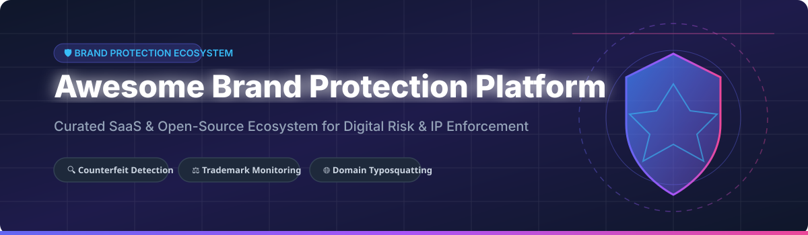

  

# 🛡️ Awesome Brand Protection Platform 🚀

## 🌟 Top Brand Protection Platform & Intellectual Property Enforcement Ecosystem 🔑

**Curated List of Enterprise SaaS Products & Open-Source GitHub Projects**  
*Focused on Counterfeit Detection, Trademark Enforcement, Phishing Mitigation, Domain Typosquatting & Digital Risk Protection*  

📅 **Last updated: September 2026**

---

### 📖 Introduction & Ecosystem Overview 💡

This repository tracks notable **SaaS platforms** and **open-source projects** for **Brand Protection**, **Digital Risk Protection Services (DRPS)**, and **Intellectual Property (IP) Enforcement**. These tools continuously monitor online marketplaces, social media platforms, rogue domains, mobile app stores, and dark web channels for counterfeit listings, trademark infringement, brand impersonation, and unauthorized sellers, enabling brand owners and legal teams to detect and enforce IP rights at scale. 🛡️

**Key Category Leaders:** Red Points 🔴, Corsearch 🔍, AppDetex (Tracer) ⚡, ZeroFox 🦊, PhishLabs 🎣, BrandShield 🛡️, MarkMonitor 🌐, and CSC Digital Brand Services 🏢.

---

## 📑 Table of Contents

- [🏢 SaaS / Hosted Enterprise Platforms](#-saas--hosted-enterprise-platforms)
- [💻 Open-Source GitHub Projects](#-open-source-github-projects)
- [🤝 How to Contribute](#-how-to-contribute)
- [☕ Support & Sponsorship](#-support--sponsorship)
- [📊 Star History](#-star-history)
- [⚠️ Disclaimer](#%EF%B8%8F-disclaimer)

---

## 🏢 SaaS / Hosted Enterprise Platforms

> 💡 **Market Insights & Industry Dynamics:**  
> The Global Brand Protection Software & Digital Risk Protection Services (DRPS) market size is estimated at **$4.2 Billion in 2026** and is projected to reach **$8.7 Billion by 2030** (CAGR ~15.8%).  
> The sector is **moderately fragmented**, undergoing rapid consolidation as private equity-backed category leaders (e.g., Corsearch, ZeroFox, OpSec) execute aggressive M&A roll-ups of boutique monitoring tools.

| Company / Product 🏢 | Market Size / Revenue / Valuation 📈 | Starting Pricing Tier 💵 | Free Tier / Trial Limit 🎁 | Key Features & Core Focus 🔍 |
| :--- | :--- | :--- | :--- | :--- |
| **[ZeroFox](https://www.zerofox.com/)** 🦊 | **$170M+ ARR** *(Acquired by Haveli Investments for ~$350M)* | Starts at $1,200/month ($14,400/yr) | 30-Day Free Trial (includes threat report scan) | Continuous scanning of e-commerce, app stores, and social platforms for brand abuse, rogue apps, and malware. Automated takedown execution. |
| **[Corsearch](https://corsearch.com/)** 🔍 | **$150M+ Revenue** *(PE-backed by Astorg & Audax)* | Starts at $1,500/month (billed annually) | 14-Day Free Demo Scan (custom sample search) | Zeal 2.0 AI-native trademark protection processing 150k+ listings/day with Cleanliness Score™ and automated enforcement workflows. |
| **[Red Points](https://www.redpoints.com/)** 🔴 | **$60M+ ARR** *(Valued ~$250M+)* | Starts at $600/month (standard brand protection tier) | 14-Day Free Brand Risk Audit (complimentary detection report) | AI-driven brand protection processing 90M+ daily signals across 200+ marketplaces. Vision AI image matching and unlimited takedown model. |
| **[MarkMonitor](https://www.markmonitor.com/)** 🌐 | **$50M+ Revenue** *(Acquired by OpSec / New Mountain)* | Starts at $2,000/month (Enterprise contract) | 7-Day Corporate Trial (Domain threat scan) | Enterprise domain threat monitoring, Domain Watch for typosquats, UDRP/URS enforcement, and full IP litigation support. |
| **[OpSec Security](https://www.opsecsecurity.com/)** 🔐 | **$40M+ Revenue** | Starts at $1,000/month | 14-Day Platform Demo & Sample Enforcement Run | Network Intelligence for uncovering counterfeit distribution networks and physical-to-digital authentication tracking. |
| **[PhishLabs](https://www.phishlabs.com/)** 🎣 | **$35M+ Revenue** *(Part of HelpSystems / Fortra)* | Starts at $800/month | 14-Day Risk Assessment Trial | Threat intelligence & digital risk mitigation across surface, deep, and dark web. Global killswitch takedown network. |
| **[CSC Digital Brand Services](https://www.cscglobal.com/)** 🏛️ | **$30M+ Division Revenue** *(Parent CSC $1B+)* | Starts at $1,500/month | 14-Day Corporate Audit Demo | Enterprise domain management, DomainSec platform, anti-phishing protection, and CrowdStrike Falcon Recon integration. |
| **[BrandShield](https://www.brandshield.com/)** 🛡️ | **$18M+ ARR** *(Publicly listed on LSE:BRND / PE backed)* | Starts at $500/month (SMB Starter Tier) | 14-Day Free Trial (includes automated site audit) | Threat cluster detection via Patterns and Matrix, social media impersonation monitoring, e-commerce counterfeit removal. |
| **[AppDetex (Tracer)](https://www.tracer.ai/)** ⚡ | **$15M+ ARR** *(Series B funded)* | Starts at $1,000/month | 14-Day Platform Demo | Human-in-the-loop AI brand security engine mapping threat networks across high-risk verticals and concurrent media streams. |
| **[Incopro](https://www.incopro.com/)** 📜 | **$12M+ Revenue** *(Acquired by Corsearch)* | Starts at $1,200/month | 14-Day Enterprise Demo | TALISMAN technology continuous monitoring, scraping intelligence, and deep network analysis for online/offline IP protection. |
| **[Pointer Brand Protection](https://corsearch.com/pointer)** 🎯 | **$8M+ Revenue** *(Acquired by Corsearch)* | Starts at $800/month | 14-Day Custom Assessment Scan | Marketplace protection, reverse image search, O2O (online-to-offline) counterfeit mapping, and paid search monitoring. |

---

## 💻 Open-Source GitHub Projects

> 🔓 **Open-Source Brand Security Ecosystem:**  
> Self-hosted solutions provide transparent, vendor-independent domain monitoring, typosquat detection, phishing defense, and product authenticity verification.

| Repository 📦 | GitHub Stars ⭐ | Primary Focus & Capabilities 🚀 | License 📄 |
| :--- | :---: | :--- | :---: |
| **[Cardano Foundation Originate](https://github.com/cardanofoundation/originate)**    | **210+ Stars** | Open-source traceability infrastructure designed to verify product authenticity, supply chain origin, and anti-counterfeit QR certification. | Apache-2.0 |
| **[SheriffMark](https://github.com/arunprasad/sheriffmark)**    | **145+ Stars** | Brand protection monitoring watching newly registered domains resembling your brand (typosquats, lookalikes, combosquats) with automated evidence collection. | AGPL-3.0 |
| **[DNSTwist](https://github.com/elceef/dnstwist)**    | **5,400+ Stars** | Domain name permutation engine for detecting typosquatting, phishing domains, and corporate brand impersonation. | Apache-2.0 |
| **[PhishEye](https://github.com/mrvishalkatke/PhishEye)**    | **85+ Stars** | Hybrid phishing URL detection tool combining XGBoost ML classifier with rule-based heuristics and real-time IMAP email scanning. | MIT |
| **[Risk Monitor Tool](https://github.com/muzammilmunir/risk-monitor-tool)**    | **65+ Stars** | MIT-licensed brand protection & risk monitoring platform featuring domain permutations, social username tracking (Sherlock integration), and trademark monitoring. | MIT |
| **[Catphish](https://github.com/ringo/catphish)**    | **450+ Stars** | Domain typosquatting and brand monitoring tool checking Certificate Transparency logs for lookalike domains. | Ruby / MIT |

### 🛠️ Open-Source Framework Building Blocks
- **[SheriffMark](https://github.com/arunprasad/sheriffmark)** — Domain typosquat monitoring & legal evidence collection 📜
- **[Risk Monitor Tool](https://github.com/muzammilmunir/risk-monitor-tool)** — Unified domain, social media username, and trademark scanner 🔎
- **[PhishEye](https://github.com/mrvishalkatke/PhishEye)** — Machine-learning phishing URL classifier & email protector ✉️
- **[Originate](https://github.com/cardanofoundation/originate)** — QR-based supply chain authenticity & provenance verification 🍇

---

## 🤝 How to Contribute

We welcome contributions from brand protection managers, IP lawyers, and open-source developers! 

1. 🍴 **Fork** this repository.
2. ✏️ **Add/edit** entries in `README.md` maintaining standard markdown formatting.
3. 📝 **Include**: Name, URL, starting pricing/stars, and accurate category details.
4. 🚀 **Submit** a Pull Request with a descriptive summary.

---

## ☕ Support & Sponsorship

If you find this brand protection curated list helpful for your research, legal practice, or security operations, please consider supporting the project! 💖

- ⭐ **Star** this repository to increase its visibility.
- 🔄 **Fork** and share with fellow brand protection and cybersecurity professionals.
- ☕ **Buy Me a Coffee / Sponsor**: Support ongoing maintenance via [GitHub Sponsors](https://github.com/sponsors/ishandutta2007).

---

## 📈 Star History

---

## ⚠️ Disclaimer

- This list is **community-curated** for educational and informational purposes only — it does not constitute legal advice or formal commercial endorsement. ⚖️
- Brand protection scanning and enforcement must comply with applicable local laws, marketplace policies, and trademark regulations. 🌐
- Open-source brand monitoring tools require self-hosted infrastructure maintenance and legal validation before automated enforcement actions. 🔒

---

  <b>Built with ❤️ for Brand Protection Managers, Legal Teams, IP Counsel &amp; Cybersecurity Researchers</b>

